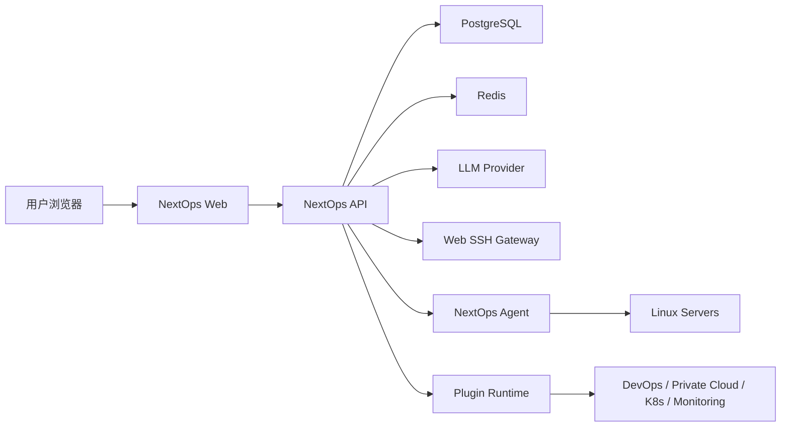

# NextOps 技术架构设计

## 1. 架构目标

NextOps V1 采用“前后端分离 + 容器化 + 插件化预留”的架构。第一阶段优先跑通本机 Demo，后续逐步把 mock 数据替换为真实数据库、Agent、Web SSH、AI 模型和插件驱动。

核心目标：

- 本机通过 Docker Compose 一键启动。
- 前端、后端、数据库、缓存解耦。
- API 先稳定，功能按模块持续迭代。
- 为 Web SSH、Agent、AI 诊断、插件系统预留边界。
- CI/CD 从 lint、test、build、docker build 起步。

## 2. 总体架构



## 3. 技术选型

| 层级 | V1 Demo 选型 | 后续演进 |
| --- | --- | --- |
| 前端 | React + Vite + TypeScript | 引入 TanStack Query、路由、组件库 |
| 后端 | Node.js + Express + TypeScript | 可演进到 NestJS 模块化架构 |
| 数据库 | PostgreSQL | Prisma/Drizzle 管理迁移 |
| 缓存/队列 | Redis | BullMQ 执行异步任务 |
| 容器 | Docker Compose | Kubernetes / Helm |
| CI/CD | GitHub Actions + Jenkinsfile | 镜像仓库、自动部署、回滚 |
| AI | 预留模型管理接口 | 接入 OpenAI 兼容 API、本地模型 |
| Web SSH | 预留终端入口 | node-pty + SSH2 + 审计回放 |
| Agent | Agent Simulator | Go/Rust Agent |

## 4. 核心服务边界

### Web

- 负责 SaaS 管理台交互。
- 承载仪表盘、ChatOps、服务器管理、告警、脚本和设置页面。
- 通过 REST API 与后端交互。

### API

- 负责认证、权限、租户隔离、资产、告警、脚本、任务、AI 诊断等业务。
- 对外提供 REST API。
- 对 Agent、插件、Web SSH 提供内部接口。

### Agent

- 负责主机信息采集、指标上报、日志采集和脚本执行。
- V1 Demo 先使用 API mock 数据模拟。

### Web SSH Gateway

- 负责浏览器终端和服务器 SSH 会话转发。
- 后续需要命令审计、敏感命令识别、会话回放和权限校验。

### Plugin Runtime

- 负责对接 Jenkins、Git、Harbor、Kubernetes、Prometheus、Loki、ELK、私有云等外部系统。
- V1 先在 API 中预留插件动作模型。

## 5. 本机部署

Docker Compose 包含：

- `nextops-web`: 前端 Web。
- `nextops-api`: 后端 API。
- `nextops-postgres`: PostgreSQL。
- `nextops-redis`: Redis。

启动命令：

```bash
npm run docker:up
```

## 6. 演进原则

- 先实现业务闭环，再补强复杂能力。
- 所有高风险操作必须有权限、确认、审计。
- AI 只生成计划和建议，执行必须经过系统校验。
- Agent、插件、Web SSH 均通过明确接口接入，避免散落在页面逻辑中。

